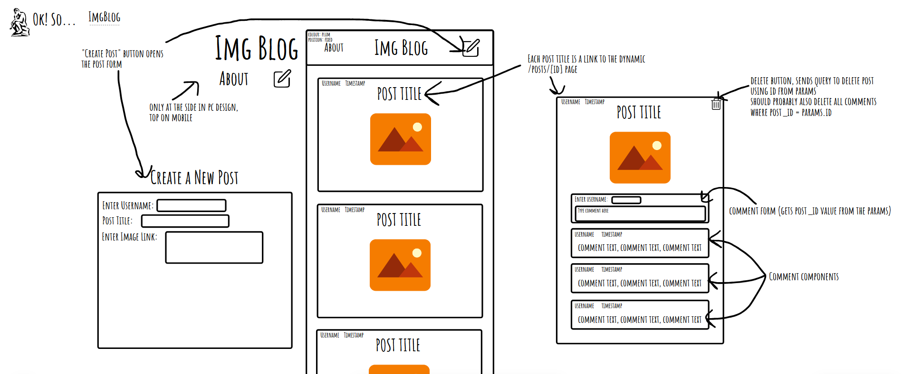
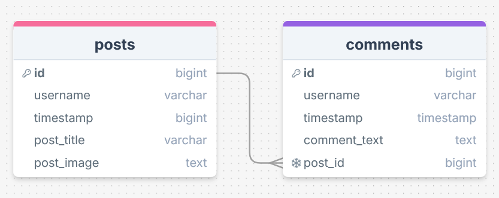
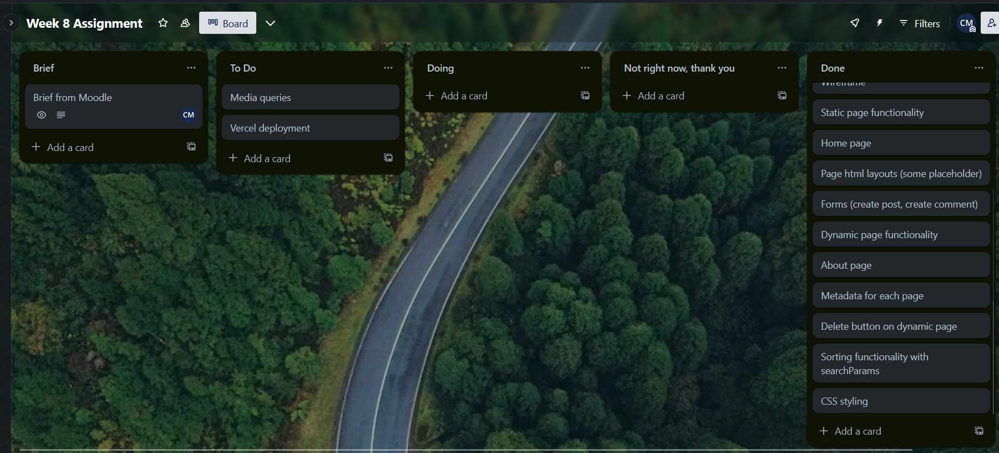

# Week 8 Assignment - Next.js Blog

## Reflection

I'm pretty happy with the results of this week's assignment (a big change from last week) and managed to achieve almost everything that I wanted.

I achieved all of the requirements with: all posts rendered on the home page and sortable in ascending or descending order, a database with a posts table and comments table joined with a foreign key, dynamic routes for each post that include all the comments for that post, a delete button on each post (only on the dynamic route) that deletes the post and all of its comments from the database, metadata on every page including dynamic metadata generation on dynamic routes, and redirects after creating or deleting a post to take users to the home page and revalidate it. I didn't attempt any of the stretch goals as I couldn't think of how to implement them (and the normal requirements took me all weekend anyway).

For the first time ever, I didn't have any major issues. The first minor issue I had was with the syntax for using <Link> with a dynamic route but that was easy to solve by googling. The next and bigger one I had was with using the timestamp from the database on a page because I didn't realise that it was an object. It took me a while to realise that the object that the error was referring to was the timestamp (which in hindsight should've been obvious because it did say 'found: [object Date]') but eventually I did realise and found the solution of using toDateString. I used this as an opportunity to expand on this now it was a formatted string so I checked mdn to find how to have date and time for the post, and found toLocaleTimeString which gave the exact result I wanted.

After that I didn't have any full blown issues but I had to take a couple of shortcuts with the code. Since all the images on the site are user submitted, I don't know how to set up my next.config.mjs properly for that (unless I only allowed images from a specific site like unsplash) so I had to set the hostname to "\*\*" to allow all images. I know that isn't a good idea for security reasons but I couldn't think of another way around it, and couldn't find anything after googling it.

The only other issue was that I ran out of time on my CSS and went past the deadline on the bits I do have, so some parts of the site (mainly the comments and the forms) don't look the way I wanted them to. I also didn't have time to do my media queries so I couldn't get the layout that I planned in my wireframe.

## Sources

Using <Link> with dynamic routes (for making each post title link to the relevant post) - https://nextjs.org/docs/pages/api-reference/components/link#linking-to-dynamic-route-segments
Converting timestamp from object to string to fix error 'Objects are not valid as a React child (found: [object Date]).' - https://stackoverflow.com/questions/53714327/objects-are-not-valid-as-a-react-child-getting-error-when-adding-div
Understanding toDateString() better and where I heard about toLocaleTimeString() - https://developer.mozilla.org/en-US/docs/Web/JavaScript/Reference/Global_Objects/Date/toDateString
Using toLocaleTimeString() without getting seconds (this is what I was wanting to do back in week 4 to get rid of seconds and milliseconds, and 4 weeks later I finally found it!) - https://stackoverflow.com/questions/17913681/how-do-i-use-tolocaletimestring-without-displaying-seconds

## Screenshots

Wireframe:

Database schema:

Trello:

